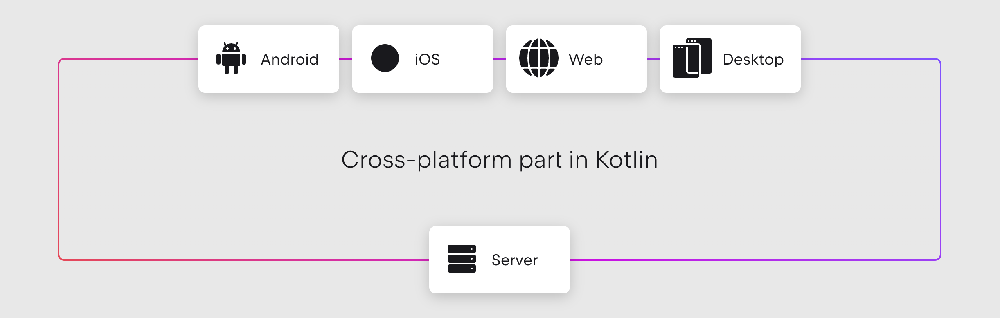
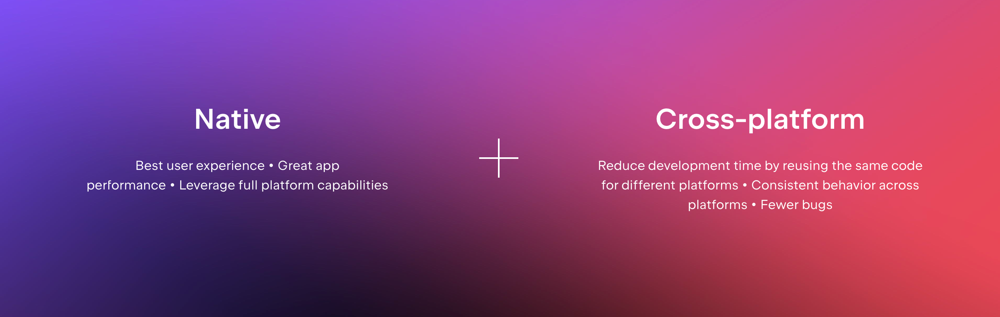

# 왜 코틀린 멀티플랫폼인가?

### 유연한 멀티플랫폼 개발을 위한 JetBrains의 오픈 소스 기술

Kotlin Multiplatform은 네이티브 프로그래밍의 이점을 유지하면서 다양한 플랫폼용 애플리케이션을 만들고 플랫폼 전체에서 코드를 효율적으로 재사용할 수 있게 해주는 기술입니다. 당신의 멀티플랫폼으로 구축된 애플리케이션은 iOS, Android, macOS, Windows, Linux 등과 같은 다양한 운영 체제에서 작동합니다.

<figure><figcaption></figcaption></figure>

### 품질 저하 없는 코드 공유

공유되는 Kotlin 코드는 플랫폼 바이너리로 컴파일되어 모든 프로젝트에 원활하게 통합됩니다. 플랫폼별 API를 활용할 수 있는 언어 기능과 함께 더 이상 네이티브 개발과 크로스 플랫폼 개발 사이에서 결정할 필요가 없습니다. 두 개발 방식의 장점을 동시에 누릴 수 있습니다!

<figure><figcaption></figcaption></figure>

### 모든 종류의 프로젝트에 적합

#### 로직을 공유

앱의 분리되고 중요한 파트를 공유하여 앱의 안정성을 향상시키세요. 이미 가지고 있는 Kotlin 코드를 재사용하여 애플리케이션을 동기화 상태로 유지하세요.

#### 로직을 공유하고 UI 네이티브를 유지

새로운 프로젝트를 시작할 때 Kotlin Multiplatform을 사용하고 데이터 처리 및 비즈니스 로직을 한 번만 구현하세요. 엄격한 요구 사항을 충족하려면 UI 네이티브를 유지하세요.

#### 코드를 100%까지 공유

여러 플랫폼에서 UI를 공유하기 위한 JetBrains의 현대적인 선언적 프레임워크인 Compose Multiplatform을 사용하여 개발 효율성을 높이고 코드를 100%까지 공유하세요.

***

### Compose Multiplatform으로 한 번에 UI를 구축

Compose Multiplatform은 Kotlin 및 Jetpack Compose를 기반으로 Android, iOS, 웹, 데스크톱(JVM을 통해)에서 UI를 공유하기 위한 선언적 프레임워크입니다.

#### 가속화된 UI 개발

서로 다른 UI 구현을 동기화하는 수고를 덜고 사용자에게 앱을 더 빠르게 제공할 수 있습니다.

#### 컴포넌트 레벨 재사용

모든 타겟 플랫폼에서 사용할 수 있는 사용자 정의 가능한 위젯으로 UI를 구축하세요. 미리 만들어진 테마를 사용하여 빠르게 시작하거나, 픽셀 단위까지 나만의 시각적 스타일을 만드세요.

#### 필요할 때 네이티브 컴포넌트를 사용

네이티브 UI 위젯이 필요하거나 기존 네이티브 앱에 공유 UI를 포함하려는 경우 쉽게 수행할 수 있습니다.

